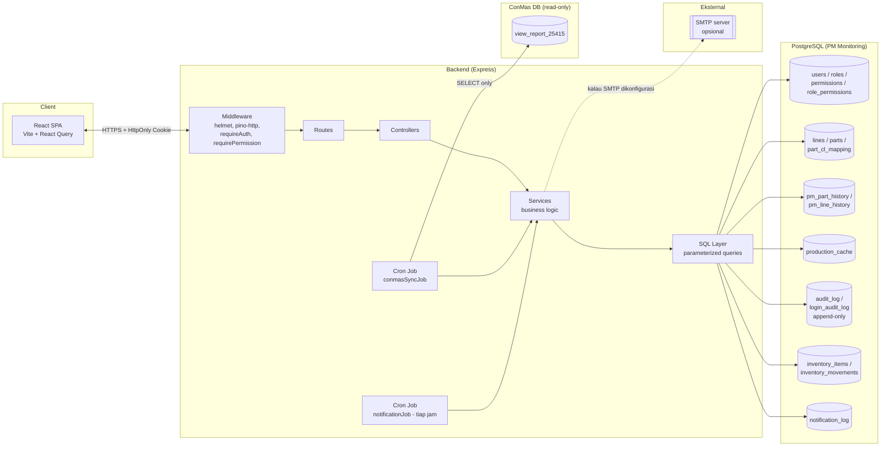

# Architecture — PM Monitoring

## Ringkasan

Internal tool untuk monitoring preventive maintenance (PM) mesin produksi,
per Line dan per Part, dengan integrasi data produksi dari sistem ConMas.

| Layer | Stack |
|---|---|
| Frontend | React 18 (Vite) + React Query + React Router |
| Backend | Node.js / Express, arsitektur layered (routes → controllers → services → sql) |
| Database | PostgreSQL |
| Integrasi eksternal | ConMas (read-only, koneksi DB terpisah); SMTP (opsional, via nodemailer) |
| Scheduler | node-cron (`conmasSyncJob`, `notificationJob`) |
| Observability | pino (structured logging) + request-id correlation |
| CI | GitHub Actions (lint + test + build, tiap push/PR) |

## Modul aplikasi

Selain PM Part/Line (fokus awal proyek), aplikasi sekarang juga mencakup:

| Modul | Fungsi | Lokasi utama |
|---|---|---|
| PM Part & PM Line | Submit & histori penggantian part / PM Monthly-Weekly | `pmPartService.js`, `pmLineService.js` |
| Inventory & ROP | CRUD item, mutasi stok, hitung Reorder Point & Safety Stock otomatis | `inventoryService.js` (`getRopMetrics()`) |
| Master Data Import | Import massal data master (Line/Part) dari file | `masterDataImportService.js` |
| CL Mapping | Mapping Part ke Change List / Drawing No | `clMappingService.js` |
| Notifikasi email | Email otomatis untuk Part DANGER & Inventory ORDER, anti-spam via jeda setting | `notificationService.js`, `notificationJob.js`, `mailer.js` |
| Role & Permission | Role custom (bukan cuma Admin/Operator) dengan akses granular per fitur | `roleManagementService.js`, `permissionMiddleware.js` |
| User Management & Approval | Registrasi mandiri (`RegisterPage`), user baru berstatus pending sampai di-approve + di-assign role oleh Admin | `userManagementService.js`, `authService.js` |
| Settings | Konfigurasi aplikasi (mis. `inventory_safety_stock_percentage`, jeda notifikasi) | `settingsService.js` |

## Diagram sistem



## Alur 1 request (contoh: `DELETE /api/v1/parts/12`)

```mermaid
sequenceDiagram
    participant FE as Frontend
    participant MW as Middleware chain
    participant CTRL as partController
    participant SVC as partService
    participant SQL as partQueries
    participant DB as PostgreSQL

    FE->>MW: DELETE /api/v1/parts/12 (cookie: token)
    MW->>MW: helmet (security headers)
    MW->>MW: pino-http (assign req.id)
    MW->>DB: requireAuth: verify JWT signature + SELECT role/is_active
    DB-->>MW: role=Admin, is_active=true
    MW->>MW: requireRole('Admin') -> lolos
    MW->>CTRL: next()
    CTRL->>SVC: deletePart(12, actorUserId)
    SVC->>SQL: countHistoryByPart(12)
    SQL->>DB: SELECT COUNT(*)
    DB-->>SVC: 0
    SVC->>SQL: BEGIN; DELETE part; recordAudit(...); COMMIT
    SQL->>DB: transaction
    DB-->>SVC: OK
    SVC-->>CTRL: success
    CTRL-->>FE: 200 { success: true }
```

Poin penting dari alur ini:
- **Role dicek ulang ke DB di setiap request** (bukan dipercaya dari JWT
  mentah) — lihat `002-db-check-role-per-request.md`.
- **Constraint bisnis** (`countHistoryByPart`) dicek di Service layer
  sebelum delete dieksekusi — mencegah data PM History jadi orphan.
- Delete + audit log dibungkus **1 transaction** — kalau salah satu gagal,
  keduanya rollback (tidak ada state "part terhapus tapi audit log kosong").

## Struktur layer backend

```
routes/          -> definisikan endpoint + middleware chain (requireAuth, requireRole)
controllers/      -> terima request, validasi input, panggil service, bentuk response
services/         -> BUSINESS LOGIC (formula PM, aturan constraint, audit)
sql/              -> query parameterized MURNI, tidak ada business logic (Dev Rules §7)
validators/        -> validasi bentuk/tipe input sebelum masuk controller
middlewares/       -> auth, role check, rate limit, error handler, security headers
utils/            -> helper lintas layer (jwt, logger, dateUtils, auditLog)
jobs/             -> cron job (ConMas sync, PM Monthly accrual)
```

Aturan yang paling ditegakkan konsisten di seluruh kode (lihat komentar
`Development Rules §7` yang muncul berulang): **business logic tidak boleh
ada di SQL Layer**. Ini kenapa `pmPartService.computeMetrics()` (formula
status/threshold) ada di Service, bukan di query SQL — meski itu berarti
pagination untuk kasus filter status jadi lebih rumit (utang teknis yang
belum ada catatan formalnya — lihat catatan di `doc/PROJECT_SCOPE.md` atau
buat `TECHNICAL_DEBT.md` kalau mau didokumentasikan) — trade-off yang
diambil sadar demi konsistensi arsitektur.

## Cross-cutting concerns

| Concern | Implementasi | Lokasi |
|---|---|---|
| Autentikasi | JWT di HttpOnly cookie, bcrypt hash | `authService.js`, `authMiddleware.js` |
| Registrasi & approval | User daftar mandiri, status pending sampai Admin approve + assign role | `RegisterPage.jsx`, `userManagementService.js` |
| Otorisasi (role) | Role di-refresh dari DB tiap request | `authMiddleware.js`, `roleMiddleware.js` |
| Otorisasi (permission) | Granular per fitur lewat `role_permissions`; Admin selalu bypass (superuser) | `permissionMiddleware.js` (`requirePermission()`), `roleManagementService.js` |
| Master Data access | Toggle terpisah (`allow_operator_edit_master_data`), sengaja TIDAK masuk sistem permission baru | `masterDataAccess.js`, `settingsService.js` |
| Security headers | Helmet (CSP, HSTS, X-Frame-Options, dll) | `app.js` |
| Rate limiting | Per-IP, khusus endpoint login | `loginRateLimiter.js` |
| Audit trail | Append-only (DB trigger), granular per aksi | `auditLog.js`, migration `1700000004000` |
| Notifikasi email | Email otomatis (Part DANGER, Inventory ORDER), anti-spam via jeda setting; skip diam-diam kalau SMTP belum dikonfigurasi | `notificationService.js`, `notificationJob.js`, `mailer.js` |
| Observability | Structured JSON log + request-id correlation | `logger.js` (pino), `pino-http` di `app.js` |
| Error handling | Generik ke client, detail cuma di log internal | `errorHandler.js` |

### Sistem Role & Permission

Ditambahkan lewat migration `1700000011000_add-role-permissions.sql`:

- `roles.is_system` menandai **Admin** & **Operator** sebagai role bawaan yang
  tidak boleh di-rename/dihapus (sebagian kode masih hardcode cek by name).
  Role baru buatan Admin lewat UI selalu `is_system = FALSE`.
- `permissions` — katalog fixed capability. Permission baru harus lewat
  migration (nempel ke fitur baru di kode); **assign** permission ke role
  bisa dari UI Role Management.
- `role_permissions` — many-to-many role ↔ permission. Role Admin tidak
  wajib punya row di sini karena `requirePermission()` selalu bypass total
  untuk role Admin.
- Katalog permission saat ini: `pm_part.submit`, `pm_line.submit`,
  `inventory.manage`. Operator di-seed persis dengan behavior sebelum
  migration ini, supaya user existing tidak kehilangan akses.
- Settings & User Management sengaja **tetap Admin-only hardcode** — belum
  dibuka granular di tahap ini karena dianggap terlalu sensitif.

## Integrasi ConMas

Koneksi ke DB ConMas **sengaja terpisah** dari koneksi DB aplikasi sendiri
(`conmasDb.js` vs `db.js`), pakai akun read-only. Kalau kredensial belum
di-provision, job sync **skip dengan warning**, bukan crash — aplikasi
tetap 100% jalan tanpa ConMas, cuma PM Monthly tidak ter-update otomatis.
Detail keputusan ini ada di `007-separate-readonly-conmas-db-connection.md`.

## Integrasi SMTP (opsional)

Sama filosofinya dengan ConMas: kredensial SMTP **tidak wajib** di-set saat
startup (lihat `env.js`). Kalau kosong, `mailer.js` cuma log warning dan
skip pengiriman — job notifikasi (`notificationJob.js`, jalan tiap jam)
tetap berjalan normal, cuma email-nya tidak terkirim.

## Dokumen terkait

- `PROJECT_SCOPE.md` — status penyelesaian per fase, syarat operasional
- `001`–`007` (file `NNN-*.md` langsung di folder `doc/`) — rationale di
  balik keputusan desain kunci (ADR)

> Catatan: dokumen `SECURITY_REVIEW.md`, `ThreatModel.md`, dan
> `TECHNICAL_DEBT.md` pernah direncanakan tapi belum dibuat di repo ini —
> jangan jadikan referensi sampai file-nya benar-benar ada.
