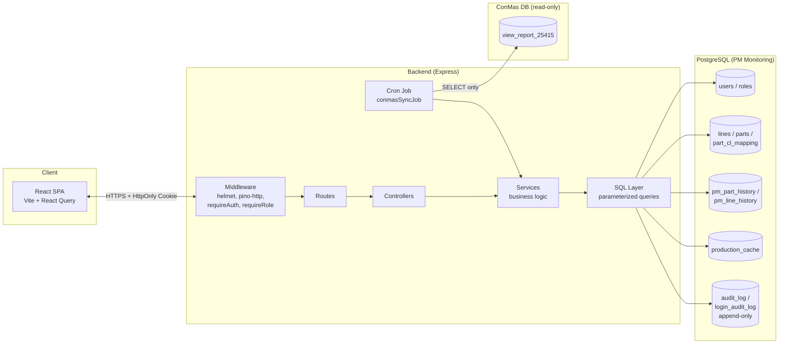

# Architecture — PM Monitoring

## Ringkasan

Internal tool untuk monitoring preventive maintenance (PM) mesin produksi,
per Line dan per Part, dengan integrasi data produksi dari sistem ConMas.

| Layer | Stack |
|---|---|
| Frontend | React 18 (Vite) + React Query + React Router |
| Backend | Node.js / Express, arsitektur layered (routes → controllers → services → sql) |
| Database | PostgreSQL |
| Integrasi eksternal | ConMas (read-only, koneksi DB terpisah) |
| Observability | pino (structured logging) + request-id correlation |
| CI | GitHub Actions (lint + test + build, tiap push/PR) |

## Diagram sistem



## Alur 1 request (contoh: `DELETE /api/v1/parts/12`)

```mermaid
sequenceDiagram
    participant FE as Frontend
    participant MW as Middleware chain
    participant CTRL as partController
    participant SVC as partService
    participant SQL as partQueries
    participant DB as PostgreSQL

    FE->>MW: DELETE /api/v1/parts/12 (cookie: token)
    MW->>MW: helmet (security headers)
    MW->>MW: pino-http (assign req.id)
    MW->>DB: requireAuth: verify JWT signature + SELECT role/is_active
    DB-->>MW: role=Admin, is_active=true
    MW->>MW: requireRole('Admin') -> lolos
    MW->>CTRL: next()
    CTRL->>SVC: deletePart(12, actorUserId)
    SVC->>SQL: countHistoryByPart(12)
    SQL->>DB: SELECT COUNT(*)
    DB-->>SVC: 0
    SVC->>SQL: BEGIN; DELETE part; recordAudit(...); COMMIT
    SQL->>DB: transaction
    DB-->>SVC: OK
    SVC-->>CTRL: success
    CTRL-->>FE: 200 { success: true }
```

Poin penting dari alur ini:
- **Role dicek ulang ke DB di setiap request** (bukan dipercaya dari JWT
  mentah) — lihat `ADR/002`.
- **Constraint bisnis** (`countHistoryByPart`) dicek di Service layer
  sebelum delete dieksekusi — mencegah data PM History jadi orphan.
- Delete + audit log dibungkus **1 transaction** — kalau salah satu gagal,
  keduanya rollback (tidak ada state "part terhapus tapi audit log kosong").

## Struktur layer backend

```
routes/          -> definisikan endpoint + middleware chain (requireAuth, requireRole)
controllers/      -> terima request, validasi input, panggil service, bentuk response
services/         -> BUSINESS LOGIC (formula PM, aturan constraint, audit)
sql/              -> query parameterized MURNI, tidak ada business logic (Dev Rules §7)
validators/        -> validasi bentuk/tipe input sebelum masuk controller
middlewares/       -> auth, role check, rate limit, error handler, security headers
utils/            -> helper lintas layer (jwt, logger, dateUtils, auditLog)
jobs/             -> cron job (ConMas sync, PM Monthly accrual)
```

Aturan yang paling ditegakkan konsisten di seluruh kode (lihat komentar
`Development Rules §7` yang muncul berulang): **business logic tidak boleh
ada di SQL Layer**. Ini kenapa `pmPartService.computeMetrics()` (formula
status/threshold) ada di Service, bukan di query SQL — meski itu berarti
pagination untuk kasus filter status jadi lebih rumit (lihat
`TECHNICAL_DEBT.md` #1) — trade-off yang diambil sadar demi konsistensi
arsitektur.

## Cross-cutting concerns

| Concern | Implementasi | Lokasi |
|---|---|---|
| Autentikasi | JWT di HttpOnly cookie, bcrypt hash | `authService.js`, `authMiddleware.js` |
| Otorisasi | Role di-refresh dari DB tiap request | `authMiddleware.js`, `roleMiddleware.js` |
| Security headers | Helmet (CSP, HSTS, X-Frame-Options, dll) | `app.js` |
| Rate limiting | Per-IP, khusus endpoint login | `loginRateLimiter.js` |
| Audit trail | Append-only (DB trigger), granular per aksi | `auditLog.js`, migration `1700000004000` |
| Observability | Structured JSON log + request-id correlation | `logger.js` (pino), `pino-http` di `app.js` |
| Error handling | Generik ke client, detail cuma di log internal | `errorHandler.js` |

## Integrasi ConMas

Koneksi ke DB ConMas **sengaja terpisah** dari koneksi DB aplikasi sendiri
(`conmasDb.js` vs `db.js`), pakai akun read-only. Kalau kredensial belum
di-provision, job sync **skip dengan warning**, bukan crash — aplikasi
tetap 100% jalan tanpa ConMas, cuma PM Monthly tidak ter-update otomatis.
Detail keputusan ini ada di `ADR/007`.

## Dokumen terkait

- `SECURITY_REVIEW.md` — status keamanan per finding, dengan risk rating
- `ThreatModel.md` — aktor ancaman & kapabilitasnya
- `TECHNICAL_DEBT.md` — utang teknis non-security & statusnya
- `PROJECT_SCOPE.md` — status penyelesaian per fase, syarat operasional
- `ADR/` — rationale di balik keputusan desain kunci
